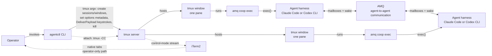

# agentctl

`agentctl` launches and operates a named fleet of AI coding agents in tmux. Each role gets one tmux window and starts
through `amq coop exec`, so the tmux session name and AMQ session name stay aligned. The CLI records enough metadata to
report objective fleet state and exposes only predefined controls such as `clear` and `compact`.

## Architecture and responsibilities

The responsibility split is deliberate:

| Component | Responsibility |
| --- | --- |
| GitHub issues | Work graph, issues, and waves |
| Planner | Orchestration, allocation, and merge policy |
| AMQ | Durable agent communication and workflow protocols |
| tmux | Process hosting, persistence, and terminal input |
| iTerm2 | Native visual interface for tmux windows |
| agentctl | Fleet launch, metadata, status, predefined controls, and managed teardown |



agentctl does not modify AMQ, infer workflow state from terminal output, or accept arbitrary keystroke payloads.

## Prerequisites and installation

To build agentctl, install Go and Make. To operate a fleet, install tmux, AMQ, and every harness named in `--roles`:

- `tmux`
- `amq`
- Claude Code for `claude` roles
- Codex CLI for `codex` roles
- iTerm2 when using `agentctl attach`

Harness and tmux behavior can change between releases. The dated versions actually exercised by the project are kept
in the [release verification checklist](docs/release-checklist.md); they are evidence, not compatibility pins.

Build, test, and install from this repository:

```bash
make build
make test
make install
```

Release identities must come from `make build`: plain `go build` inside a linked worktree records the main checkout's revision as clean, not the worktree's revision.

By default, `make install` writes `agentctl` to `~/.local/bin/agentctl`. Ensure `~/.local/bin` is on `PATH`:

```bash
export PATH="$HOME/.local/bin:$PATH"
agentctl --help
```

`PREFIX` and `DESTDIR` may be supplied to Make for packaging or a different installation prefix.

## Quickstart: launch an eight-role fleet

Run `launch` from the application repository the agents should work in. That directory becomes every agent window's
working directory unless `--dir` names a different existing directory.

```bash
cd /path/to/application

agentctl launch \
  --session epic123 \
  --roles planner:claude,codex1:codex,codex2:codex,codex3:codex,codex4:codex,reviewer-opus:claude,reviewer-codex:codex,designer:claude \
  --models planner:fable,reviewer-opus:opus-4.8,reviewer-codex:gpt5.6-sol-xhigh
```

The role is the stable fleet identity, tmux window name, and AMQ handle. The harness selects `claude` or `codex`; an
optional model selects a harness configuration without changing the role. Roles omitted from `--models` use their
harness default.

Check the fleet before acting on it:

```bash
agentctl status --session epic123
agentctl status --session epic123 --json
```

To open the eight role windows as native tabs, first enable this exact setting:

```text
iTerm2 Settings
→ General
→ tmux
→ When attaching, restore windows as tabs in the attaching window
```

Then run the operator command from iTerm2, outside tmux:

```bash
agentctl attach --session epic123
```

The attaching window opens the `planner`, `codex1`–`codex4`, `reviewer-opus`, `reviewer-codex`, and `designer` tmux
windows as native iTerm2 tabs. Detaching or closing iTerm2 does not terminate the agents; run the same command again to
reopen them.

> **Before sending a control:** do not run `clear` or `compact` while the fleet is saturating the host. Delivery is
> keystroke-based and is not transactional: success means tmux accepted the keys, not that the agent TUI executed the
> command. The retained one-second settle delay has the best evidence behind it, but it is not a proven floor under
> adversarial load. The orchestrator must avoid issuing controls while its own fleet saturates the machine; a human
> operator inherits the same rule. See [Security](#security-and-operating-model) for the measured residual risk.

After confirming the target role and host state, deliver a predefined control:

```bash
agentctl clear --session epic123 codex2
agentctl compact --session epic123 reviewer-codex
```

When the fleet is no longer needed, terminate the managed tmux session:

```bash
agentctl kill --session epic123
```

## Command reference

### `version`

```text
agentctl version
agentctl --version
```

Prints one line in the form `agentctl IDENTITY` and exits without contacting tmux. Project builds made with `make
build` use the exact `git describe --tags --always --dirty` identity stamped by the Makefile. A binary built directly
with Go instead reports its recorded VCS revision, followed by `+dirty` when Go recorded a modified checkout, or
`development` when the binary carries no build identity. The `--version` alias is accepted only as the sole argument.

### `launch`

```text
agentctl launch --session SESSION --roles ROLE:HARNESS,... [--models ROLE:MODEL,...] [--dir PATH]
```

Creates a new managed tmux session. `--session` and `--roles` are required. Supported harnesses are `claude` and
`codex`. `--models` is optional and may name only roles present in `--roles`. `--dir` overrides the invocation working
directory and must name an existing directory. Launch fails rather than adopting an existing session.

### `attach`

```text
agentctl attach [--session SESSION]
```

Starts tmux control-mode attachment for the resolved managed session. Run it from iTerm2 (`TERM_PROGRAM=iTerm.app`)
and outside tmux. It validates the current agentctl management and version markers, attaches by the resolved session
ID, and never creates a session. This is a human operator command, not a planner operation.

An ownership-gate refusal gives the direct-tmux escape hatch. For session `epic123`, the exact forms are:

```text
agentctl: refusing to attach; session "epic123" is not managed by agentctl; to attach anyway, run: tmux -CC attach-session -t '=epic123'
agentctl: refusing to attach; managed session carries no @agentctl_version marker; to attach anyway, run: tmux -CC attach-session -t '=epic123'
agentctl: refusing to attach; session "epic123" has @agentctl_version="2"; expected "1"; to attach anyway, run: tmux -CC attach-session -t '=epic123'
```

The escape hatch deliberately bypasses agentctl's ownership gate; using it is the operator's decision. A missing or
ambiguous session, a non-iTerm2 environment, an invocation already inside tmux, or failure to establish control mode
is reported instead and does not create a new session.

### `status`

```text
agentctl status [--session SESSION] [--json]
```

Reports objective tmux, metadata, and root-process facts. The default is a human-readable table; `--json` emits the
versioned machine-readable report.

### `clear`

```text
agentctl clear [--session SESSION] ROLE
```

Validates the managed session, role window, sole live pane, recorded process identity, and self-target guard before
delivering the fixed `/clear` payload. No caller-supplied payload is accepted.

### `compact`

```text
agentctl compact [--session SESSION] ROLE
```

Runs the same fail-closed target checks as `clear`, then delivers the fixed `/compact` payload.

### `kill`

```text
agentctl kill [--session SESSION]
```

Terminates the resolved tmux session only when its agentctl management and version markers are valid. It refuses
unmanaged sessions.

### Session selection

`launch` always requires `--session`. `status`, `clear`, `compact`, and `kill` resolve the session in this order:

1. an explicit `--session SESSION`;
2. a nonempty `AGENTCTL_SESSION` environment variable;
3. the current tmux session, when `TMUX_PANE` identifies the caller.

An explicit empty `--session=` is rejected, as is any invalid nonempty explicit or environment value; those sources do
not silently fall through. An empty `AGENTCTL_SESSION` is instead treated as absent. `attach` accepts the explicit and
environment sources, but it must run outside tmux, so the current-tmux fallback is not available to that command.

## Understanding status

Status is roster-driven: it reports the roles recorded when the fleet launched, including a role whose window has
since disappeared. State precedence is fail-closed, so the first applicable state below wins.

| State | Meaning |
| --- | --- |
| `ambiguous` | More than one window has the role's exact name; each match is shown and no single target is assumed. |
| `unmanaged` | Window metadata does not describe the expected managed role, or the window has more than one pane. |
| `missing` | No exact role window exists, or the matching window has no pane. |
| `dead` | A surviving pane explicitly reports that it is dead. |
| `unexpected-process` | The live pane's observed root executable does not match its launch baseline, or identity cannot be verified. |
| `running` | The managed window, sole live pane, and recorded process identity all match. |

Exited agents normally report `missing`, not `dead`. Managed windows do not use tmux `remain-on-exit`, so a window
normally disappears when its agent exits. `dead` is reserved for the distinct case where a pane still exists and tmux
reports it dead.

Status does not claim that a `running` agent is idle, healthy at the application level, or following the intended
workflow. It reports only the objective state agentctl can verify without scraping agent output.

## Security and operating model

agentctl is a single-user accident-prevention tool, not a security boundary against other processes running as the
same user. It validates identifiers, hardcodes its control payloads, addresses tmux objects by resolved IDs, checks
management metadata and launch-time process identity, and refuses to target its own pane when invoked from inside
tmux.

These checks reduce wrong-target accidents but cannot make terminal input transactional. Under deliberate CPU
saturation, verification observed delayed, missing, and doubled input. No wrong command selection was observed, but a
future truncated payload could still select another harness command. Therefore:

- do not issue controls while the fleet is saturating the host;
- treat a successful `clear` or `compact` as delivery, not confirmed execution;
- check `status` and the named role before sending a control;
- investigate `ambiguous`, `unmanaged`, and `unexpected-process` rather than bypassing them with direct tmux input.

Read [SECURITY.md](SECURITY.md) for the threat model, accepted residuals, and measured evidence.

## Troubleshooting tmux environment staleness

A tmux server keeps an environment that may be older than the shell running agentctl. Credentials or configuration
exported after the server started might therefore be absent from newly launched agent windows even though they are
visible in the current shell.

If an agent starts without an expected variable, inspect the tmux server environment and update it deliberately with
tmux's environment commands, or restart the tmux server after preserving any sessions you still need. Resolve the
environment before launching a replacement fleet; agentctl does not infer or synchronize credentials.

## Maintainers and release verification

- The approved [design specification](docs/superpowers/specs/2026-08-01-agentctl-design.md) is the source of contract
  detail; [the implementation brief](docs/brief.md) records the original requirements.
- [SECURITY.md](SECURITY.md) defines the security posture and accepted residuals.
- [docs/release-checklist.md](docs/release-checklist.md) records observed tool versions and the manual tmux/harness
  verification required for relevant releases. In particular, it explains the evidence behind the retained
  keystroke-settle constant.
- `docs/superpowers/plans/` contains working plans only; plans are never normative.
